Introduction
============

Amazon Lex is a service for building conversational voice and text
chatbot into any application. The project aims to design a chatbot using
Amazon Lex, lambda function, and a web UI hosted in S3. Further, the
chatbot can be embedded in any website using a simple javascript
snippet.

The project is a chatbot where users can book movie tickets. It starts
the booking process when user types or speaks in specific sentences such
as 'Book movie ticket for me'. The chatbot then asks multiple questions
regarding the ticket booking, such as movie name, theater name, date,
time, and the number of tickets. In the end, the chatbot also asks the
mobile number. If the user confirms the ticket, then an SMS is sent to
the user's mobile number by having ticket details.

AWS Services Used
=================

-   Amazon Lex

-   Lambda

-   Simple Notification Services (SNS)

-   Cloud Formation

-   S3 Storage Services

Important URLs
==============

> The chatbot is hosted as static website on S3 and can be accessed
> using the following URLs:

1.  Chatbot web UI URL:
    <https://lex-web-ui-codebuilddeploy-3vuv8sbyy-webappbucket-16q40csso1dpu.s3.us-east-1.amazonaws.com/parent.html>

2.  Chatbot web UI in full screen:
    <https://lex-web-ui-codebuilddeploy-3vuv8sbyy-webappbucket-16q40csso1dpu.s3.us-east-1.amazonaws.com/index.html>

3.  SnippetUrl to embed chatbot in website:
    <https://lex-web-ui-codebuilddeploy-3vuv8sbyy-webappbucket-16q40csso1dpu.s3.us-east-1.amazonaws.com/iframe-snippet.html>

Design Steps -- Amazon Lex
==========================

-   Create chatbot -- open amazon Lex and click on create

> 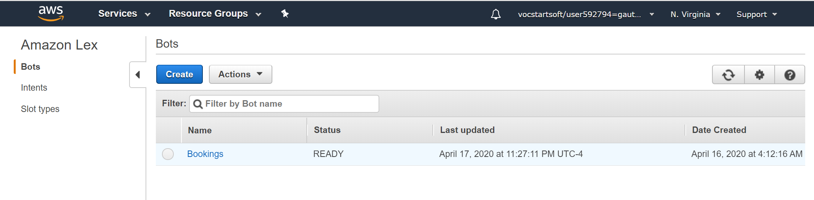{width="6.5in" height="1.601388888888889in"}

-   Create a custom bot by proving **Bot Name,** voice, session timeout,
    COPPA as no, and click on create. Bot name is an important entity
    and further used in cloud formation and lambda functions.

> 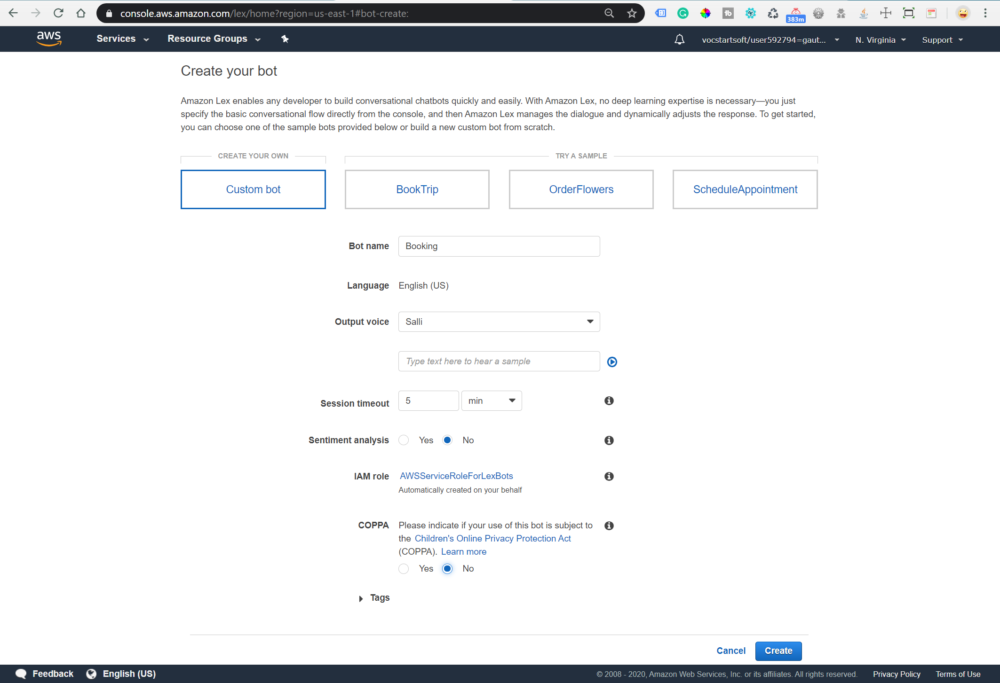{width="6.5in" height="4.442361111111111in"}

-   Add slots to the bot: Slot is a list of predefined data types for
    chatbots such as movies list or theater name list.

> 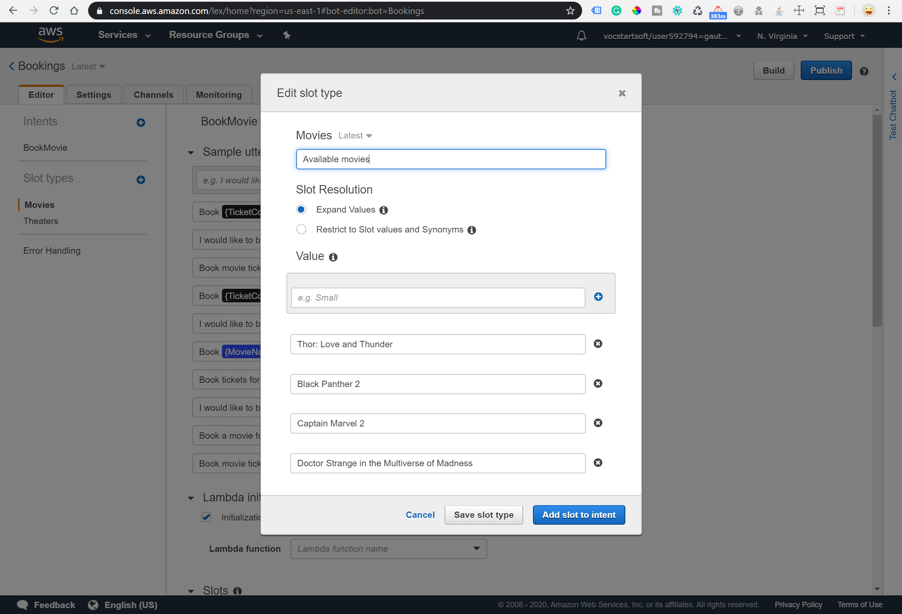{width="6.5in" height="4.427083333333333in"}

-   The chatbot requires several details such as:

1.  Sample Utterances: A string to trigger the chatbot booking process.

> Eg. Book movie tickets for me
>
> 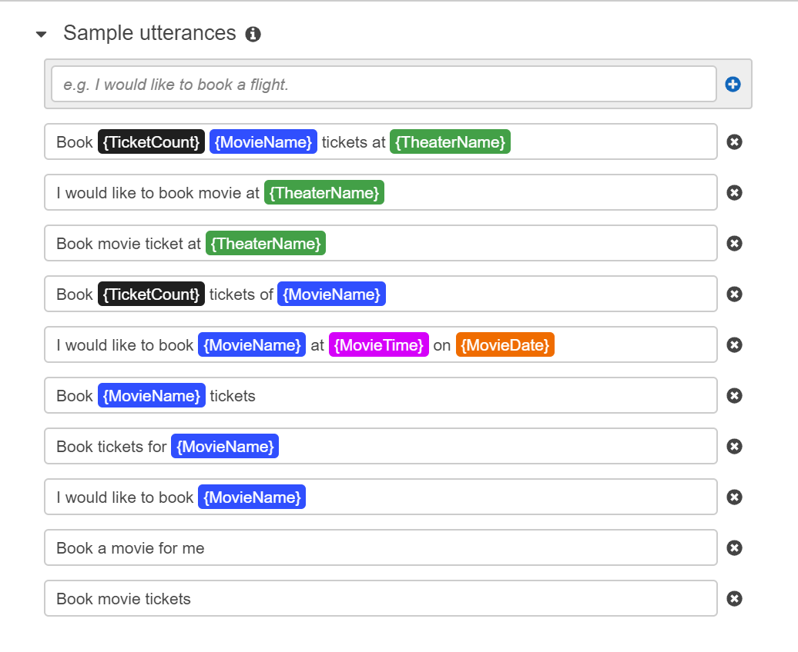{width="3.8472222222222223in"
> height="3.1488845144356956in"}

2.  Lambda initialization: A function to validate inputs given by the
    user. For, e.g., a movie is currently showing or
    not.{width="6.5in" height="2.4625in"}

3.  Slots: list of questions to ask the user.

> 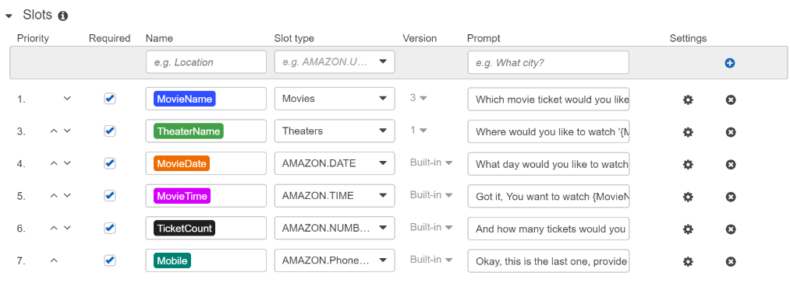{width="6.5in" height="2.3930555555555557in"}

4.  We can further edit each slot using the setting button to show
    buttons and images.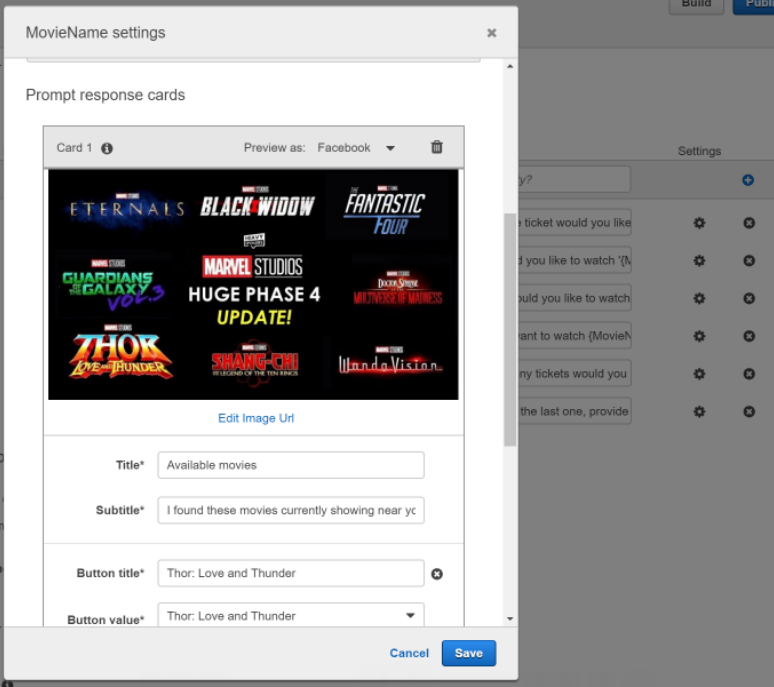{width="3.638057742782152in"
    height="3.2291666666666665in"}

5.  Confirmation prompt: When the user answers all questions, then it
    shows a confirmation message on the chatbot screen and asks the user
    to confirm the booking order.

> 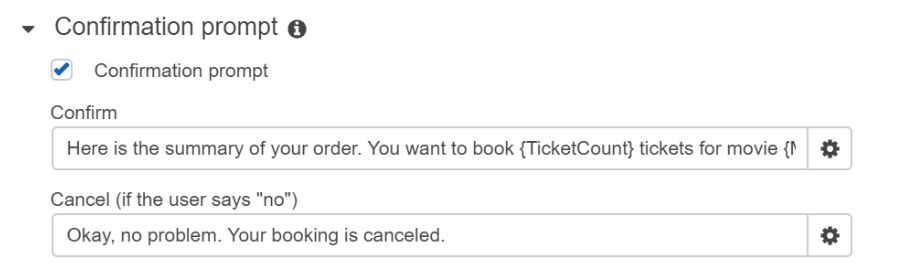{width="6.5in" height="1.976388888888889in"}

6.  Fulfillment: A lambda function to trigger when user type Yes to
    confirm the confirmation prompt. It can perform final tasks such as
    confirming tickets and sending a message to the user mobile number.

> 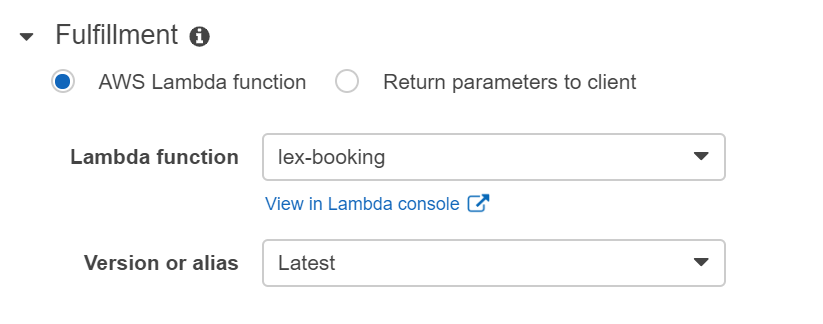{width="6.5in" height="2.5590277777777777in"}

Design Steps -- Lambda function
===============================

A lambda function performs initialization, validation, and fulfillment
in a chatbot. It returns either a success or a fail flag with a failure
message. If it is a success, then chatbot asks the next question;
otherwise, chatbot shows the failure message on the chatbot screen and
asks the question again.

**[Validation]{.underline}**: It performs the following user inputs
validation.

-   When the user enters a movie name, then it should be the predefined
    > list.

-   When the user enters a theater name, then it should be in the
    > predefined list.

-   Users can book up to a 1-month ticket in advance from today's date.

-   The number of ticket bookings is restricted from 1 to maximum
    > booking up to 10.

**[SMS:]{.underline}**

-   When the user confirms the confirmation prompt, then lambda
    > constructs a ticket confirmation message and sends it to the
    > user's mobile number using Amazon SNS services.

Design Steps -- Cloud formation for Chatbot web UI
==================================================

The UI of the chatbot is created by using the
[aws-lex-web-ui](https://github.com/aws-samples/aws-lex-web-ui) project.
The project provides a cloud formation stack that creates a static
website on the S3 bucket for the chatbot web UI.

-   Launch cloud formation stack using the below link.

> {width="1.1180555555555556in"
> height="0.20833333333333334in"}

-   In **Lex Bot Configuration Parameter** enter the bot name create in
    > Amazon Lex.

-   In **Web Application Parameters** provide the details-

1.  WebAppParentOrigin: The website URL in case if hosting chatbot on
    > your website

2.  WebAppConfBotInitialText: First message displayed on chatbot UI

3.  WebAppConfBotInitialSpeech: Speech to start the booking process

4.  WebAppConfToolbarTitle: Title for chatbot

    -   After AWS CloudFormation launches the stack (the status is
        > CREATE\_COMPLETE), then check Outputs tab for the value of:

> ParentPageUrl: Webpage with a chatbot on the right bottom
>
> WebAppUrl: Full-Screen chatbot UI
>
> SnippetURL: has JS code to integrate chatbot UI in any web
> application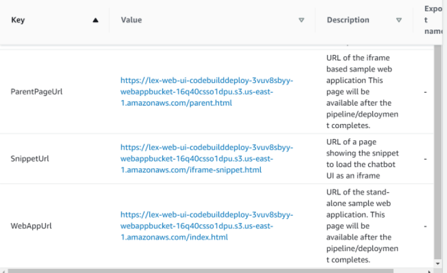{width="3.793465660542432in"
> height="2.3194444444444446in"}

Demo- Chatbot Web UI
====================

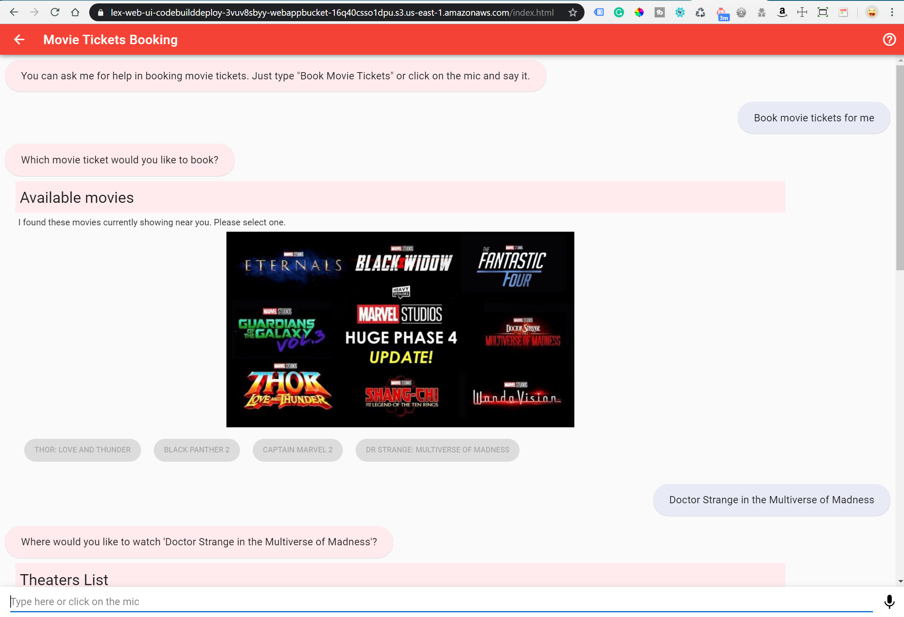{width="5.743055555555555in"
height="3.9238068678915137in"}

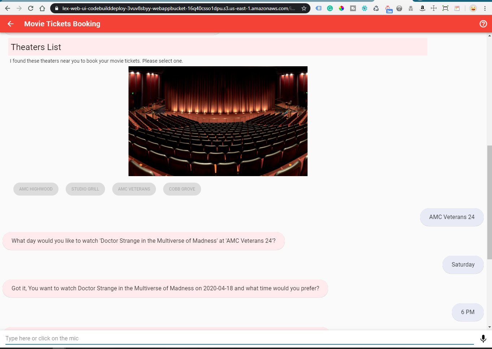{width="5.773218503937008in"
height="4.104166666666667in"}

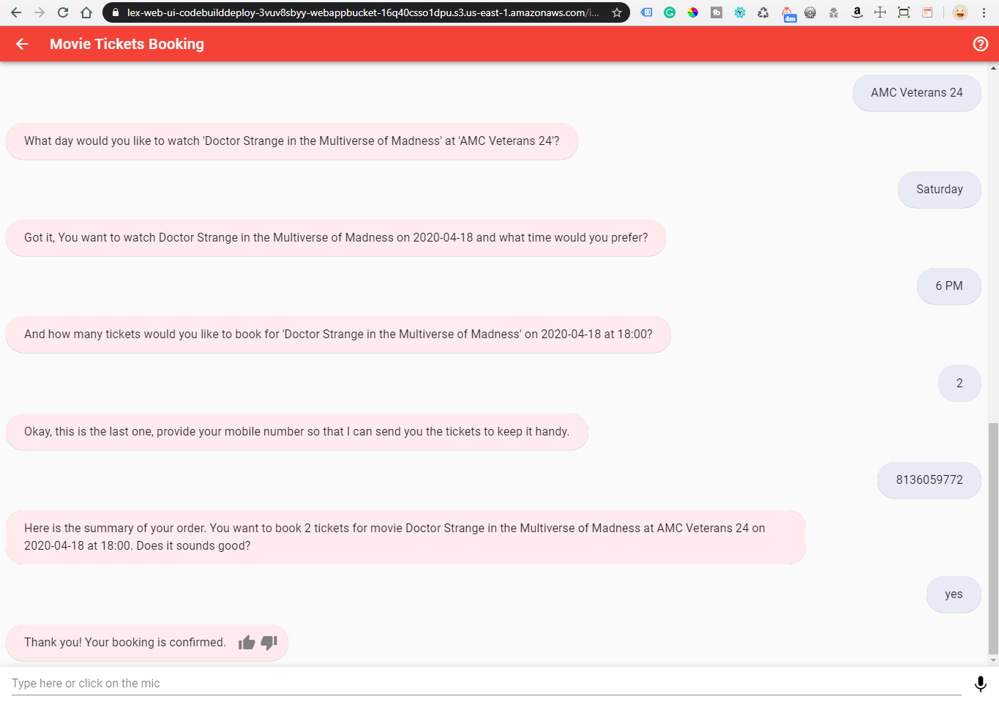{width="5.909722222222222in"
height="4.151958661417323in"}

> {width="2.0811986001749783in"
> height="4.506944444444445in"}
>
> **[Thank you]{.underline}**
